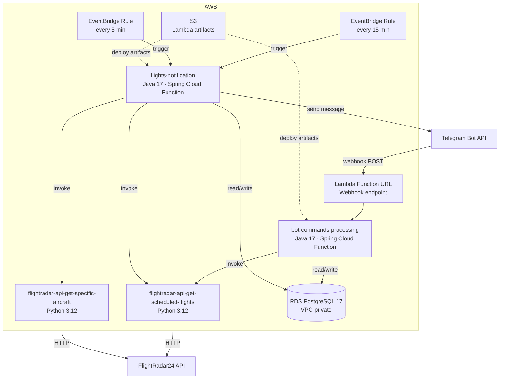

<div align="center">

# ✈️ Aviation Telegram Bot

**Real-time wide-body aircraft tracking and arrival notifications delivered straight to your Telegram.**

[](https://openjdk.org/projects/jdk/17/)
[](https://www.python.org/downloads/release/python-3120/)
[](https://spring.io/projects/spring-boot)
[](https://aws.amazon.com/lambda/)
[](https://www.terraform.io/)
[](https://www.postgresql.org/)
[](LICENSE)

</div>

---

## Overview

Aviation Telegram Bot is a fully **serverless** application that monitors arriving flights at your chosen airport and pushes real-time notifications to Telegram — purpose-built for **aviation enthusiasts and plane spotters**.

Flight data is sourced via the **[FlightRadar24](https://github.com/JeanExtreme002/FlightRadarAPI)** Python library, but the bot solves a core limitation that FlightRadar24 itself doesn't address: **scheduled flight data has no built-in filtering**. When you look up arrivals for a busy hub like Dubai or London Heathrow, you get hundreds of flights — narrow-bodies, cargo, regional turboprops — most of which a spotter doesn't care about.

FlightRadar24 also has no notification system for scheduled arrivals — meaning you have to keep manually refreshing the arrivals board to see what's coming. This bot eliminates that entirely. It watches the schedule for you, filters by the **wide-body aircraft families** you actually care about — A380s, B747s, B777s, A350s, and more — and sends you a Telegram message the moment something relevant is added or changes status.

> **Set your airport, pick your aircraft, and put your phone down. The bot will tell you when it's time to look up.**

---

## Features

| Category | Details |
|---|---|
| **New Arrival Alerts** | Notified when a matching flight is added to your airport's arrival schedule |
| **Flight Status Updates** | Delays, cancellations, diversions, and ETA changes (>40 min threshold) |
| **Arriving Soon** | Alert 35 minutes before touchdown |
| **Landing Confirmation** | Notification when the aircraft touches down |
| **Aircraft Filters** | Per-user toggle for specific aircraft families (A380, B777, B747, A350 …) |
| **Airport Selection** | Search and set any IATA/ICAO airport worldwide |
| **Duplicate Prevention** | Each notification type tracked individually — no repeated alerts |
| **Timezone Awareness** | All times formatted in the user's local timezone |

---

## Architecture

The bot is built entirely on AWS serverless primitives. No EC2 instances, no always-on processes.



### Lambda Functions

| Function | Runtime | Memory | Trigger | Purpose |
|---|---|---|---|---|
| `bot-commands-processing` | Java 17 | 512 MB | Telegram webhook (Function URL) | Handle `/start`, `/airport`, `/aircraft` commands and callbacks |
| `flights-notification` | Java 17 | 512 MB | EventBridge (5 min & 15 min) | Fetch new arrivals, detect status changes, send notifications |
| `flightradar-api-get-scheduled-flights` | Python 3.12 | 256 MB | Lambda invoke | Fetch & filter arriving flights from FlightRadar24 |
| `flightradar-api-get-specific-aircraft` | Python 3.12 | 256 MB | Lambda invoke | Query live aircraft positions |
| `flightradar-api-get-airport` | Python 3.12 | 256 MB | Lambda invoke | Airport lookup utility |

---

## Tech Stack

### Application
- **Java 17** — bot command processing and notification logic
- **Spring Boot 4** with **Spring Cloud Function** — AWS Lambda adapter for Java
- **Spring Data JPA** — database access layer
- **Python 3.12** — lightweight API-fetching layer
- **[FlightRadar24 1.4.0](https://github.com/JeanExtreme002/FlightRadarAPI)** — real-time flight data (arrivals schedule, aircraft images, live status)
- **BeautifulSoup4** + **cloudscraper** — HTML parsing and request resilience

### Infrastructure
- **AWS Lambda** — all compute, fully serverless
- **Amazon RDS PostgreSQL 17** — persistent state (users, flights, notifications)
- **Amazon EventBridge** — scheduled polling triggers
- **Lambda Function URLs** — zero-config HTTP endpoint for Telegram webhook
- **Amazon S3** — Lambda deployment artifact storage
- **AWS VPC** — RDS isolated in private subnet

### DevOps
- **Terraform** — all AWS infrastructure defined as code
- **GitHub Actions** — separate CI/CD pipelines per Lambda (Java JAR build → S3 upload → Lambda update)
- **Gradle + Shadow Plugin** — fat JAR packaging for Java Lambdas

---

## Bot Commands

| Command | Description |
|---|---|
| `/start` | Register your account |
| `/airport` | Set your monitored airport (IATA or ICAO) |
| `/aircraft` | Toggle aircraft family filters |

The bot uses **Telegram inline keyboards** for interactive filter selection and sends aircraft photos as media groups (up to 10 images).

---

## Deployment

Infrastructure and deployment are fully automated. Manual steps are only required for the initial bootstrap.

### Prerequisites
- [Terraform](https://developer.hashicorp.com/terraform/install) ≥ 1.0
- [AWS CLI](https://docs.aws.amazon.com/cli/latest/userguide/install-cliv2.html) configured
- A Telegram bot token from [@BotFather](https://t.me/botfather)

### 1. Provision Infrastructure

```bash
cd terraform
terraform init
terraform apply
```

### 2. Configure Environment Variables

The following variables are required for the Lambda functions:

| Variable | Description |
|---|---|
| `BOT_TOKEN` | Telegram bot token |
| `DB_HOST` | RDS PostgreSQL hostname |
| `DB_NAME` | Database name |
| `DB_USERNAME` | Database user |
| `DB_PASSWORD` | Database password |
| `FLIGHTRADAR_API_LAMBDA_NAME` | Name of the FlightRadar24 API Lambda |
| `AWS_REGION` | AWS region (default: `us-east-1`) |

### 3. Run Database Migrations

```bash
psql -h <DB_HOST> -U <DB_USERNAME> -d <DB_NAME> -f sql/create_tables.sql
```

Seed airport, aircraft family, and wide-body aircraft reference data from `sql/dumps/`.

### 4. Register Telegram Webhook

Point Telegram to your Lambda Function URL:

```bash
curl "https://api.telegram.org/bot<BOT_TOKEN>/setWebhook?url=<FUNCTION_URL>"
```

### CI/CD

Each Lambda has a dedicated GitHub Actions workflow that triggers automatically on relevant path changes:

- `deploy-bot-commands-processing-lambda.yml` — builds JAR, uploads to S3, updates Lambda
- `deploy-flights-notification-lambda.yml` — same for the notification Lambda
- `deploy-flightradar-api-lambdas.yml` — packages and deploys all three Python Lambdas
- `terraform.yml` — applies infrastructure changes

---

## FlightRadar24 Integration

Flight data is sourced via the [`FlightRadar24`](https://github.com/JeanExtreme002/FlightRadarAPI) Python library. The integration fetches up to **3 pages of arrival data** per airport concurrently using `ThreadPoolExecutor`, then filters results by user-selected aircraft family codes.

> The library headers are patched with a mobile app `User-Agent` to avoid `403 Forbidden` responses from the upstream API — a known issue tracked for removal once the library is updated.

---

## License

[MIT](LICENSE) © 2026 Tymofii Dmytrenko